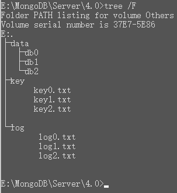

这个同步不要使用pipenv虚拟环境，已踩坑!!! 报错如下
```
importlib_metadata.api.PackageNotFoundError: importlib_metadata
```


# 步骤
安装mongo-connector
```
pip install mongo-connector
```

安装elastic2-doc-manager
```
pip install elastic2-doc-manager
pip install elastic-doc-manager[elastic5]
```

# mongo类集群(3台)
| IP        | port  | db目录     | keyfile目录  | log目录       |
| --------- | ----- | ---------- | ------------ | ------------- |
| 127.0.0.1 | 27017 | \data\db0\ | \key\key0.txt | \log\log0.txt |
| 127.0.0.1 | 27018 | \data\db1\ | \key\key1.txt | \log\log1.txt |
| 127.0.0.1 | 27019 | \data\db2\ | \key\key2.txt | \log\log2.txt |
**keyfile的内容编码必须是ANSI(UTF-8会报错)**



生成key
```
openssl rand -base64 756 > key0.key
```

启动mongo
```
mongod --port 27017 --dbpath E:\MongoDB\Server\4.0\data\db0 --keyFile E:\MongoDB\Server\4.0\key\key0.txt --logpath E:\MongoDB\Server\4.0\log\log0.txt --logappend --replSet rs

mongod --port 27018 --dbpath E:\MongoDB\Server\4.0\data\db1 --keyFile E:\MongoDB\Server\4.0\key\key1.txt --logpath E:\MongoDB\Server\4.0\log\log1.txt --logappend --replSet rs

mongod --port 27019 --dbpath E:\MongoDB\Server\4.0\data\db2 --keyFile E:\MongoDB\Server\4.0\key\key2.txt --logpath E:\MongoDB\Server\4.0\log\log2.txt --logappend --replSet rs
```

初始化复制集操作
```
> config = {'_id':'rs',members:[{'_id':0,'host':'127.0.0.1:27017'},{'_id':1,'host':'127.0.0.1:27018'},{'_id':2,'host':'127.0.0.1:27019'}]}
{
        "_id" : "rs",
        "members" : [
                {
                        "_id" : 0,
                        "host" : "127.0.0.1:27017"
                },
                {
                        "_id" : 1,
                        "host" : "127.0.0.1:27018"
                },
                {
                        "_id" : 2,
                        "host" : "127.0.0.1:27019"
                }
        ]
}
> rs.initiate(config)
{ "ok" : 1 }
```

创建管理员用户
```
rs:PRIMARY> use admin
switched to db admin
rs:PRIMARY> db.createUser({user:"admin", pwd:"admin", roles:[{role:"userAdminAnyDatabase", db:"admin"}]})
Successfully added user: {
        "user" : "admin",
        "roles" : [
                {
                        "role" : "userAdminAnyDatabase",
                        "db" : "admin"
                }
        ]
}
```

同步
```
mongo-connector -m localhost:27017 -t localhost:9200 -d elastic2_doc_manager -a admin -p admin

-m   mongodb_host:port    —— 数据源地址，mongodb数据库地址。
-t   target_host:port     —— 数据目的地地址，elasticsearch集群地址。
-d   xxx_doc_manager      —— 数据目的地的document类型，elastic2_doc_manager或elastic_doc_manager。 
-n   db.collection ...    —— 待同步的数据库及其collection。默认同步所有数据库。
-a   admin-username       —— admin用户名
-p   password             —— 密码

更过参数，请通过mongo-connector -h 命令查看
```

再测试是否同步


**开启同步服务流程**
1. 打开3个mongo节点(记得认证)
2. 打开elasticsearch, kibana(非必要), elasticsearch-head(非必要)
3. 打开同步


# 常见错误
## replSetInitiate quorum check failed because not all proposed set members responded affirmatively: 127.0.0.1:27018 failed with Authentication failed., 127.0.0.1:27019 failed with Authentication failed.

防火墙