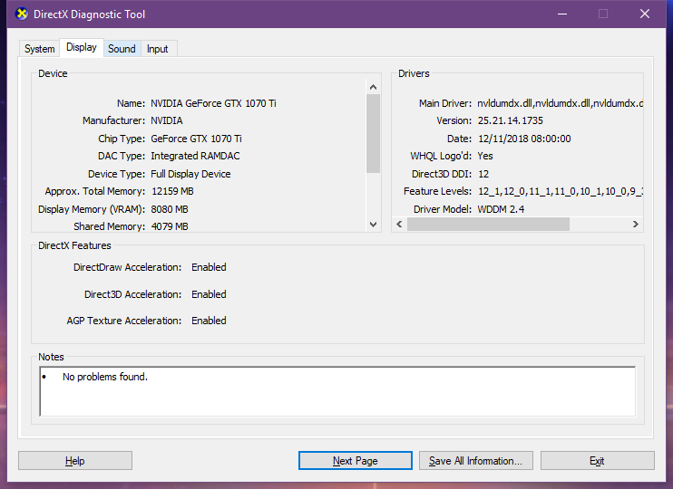

<style>
.important {
    color: red;
    font-weight: 900;
}
</style>

# 集群配置
## 1. 机器配置
### 主机硬件



### 软件
- VMware-workstation-full-12.1.1-3770994.exe
- XShell5
- <div class='important'>jdk1.8.0_191</div>
- elasticsearch-6.5.4.tar.gz
- kibana-6.5.4-linux-x86_64.tar.gz

### 分布式
3台虚拟机
系统镜像: CentOS-7.3-x86_64-DVD-1611.iso

## 2. 基本安装
1. 安装jdk
```shell
配置环境变量
vi /etc/profile.d/java.sh

JAVA_HOME=/usr/local/java/jdk1.8.1_191
CLASSPATH=$JAVA_HOME/lib/:$CLASSPATH
PATH=$JAVA_HOME/bin/:$PATH
export JAVA_HOME CLASSPATH PATH
```
2. 关闭防火墙
```
systemctl stop firewalld.service
systemctl disable firewalld.service
```
3. 配置Elasticsearch
   
由于Elasticsearch的主节点是通过集群"选举"出来的，所以每个节点均有可能为主节点
```
vim elasticsearch.yml

# 集群名
cluster.name: gdy-elasticsearcher
# 节点名
node.name: es-node-1
# 是否为主节点
node.master: true
# 是否为数据节点
node.data: true
# 数据和日志路径
path.data: /data/elasticsearch/data
path.logs: /data/elasticsearch/logs
# 集群地址设置
discovery.zen.ping.unicast.hosts: ["192.168.137.10", "192.168.137.11", "192.168.137.12"]
# 节点数目配置# 防止集群发生“脑裂”，即一个集群分裂成多个，配置集群最少主节点数目 (可成为主节点的主机数目 / 2) + 1
discovery.zen.minimum_master_nodes: 2
# 当最少几个节点回复之后，集群就正常工作
gateway.recover_after_nodes: 2
```
当然这里不要忘记了创建好/data目录，并配置好权限
```
mkdir -p /data/elasticsearch/data
mkdir -p /data/elasticsearch/logs
chown -R elastic:elastic /data
```

启动Elasticsearch
```
./bin/elasticsearch -d
-d 可以后台启动
```

2. 安装Kibana
安装步骤类似Elasticsearch

3. 

## 3. 添加节点
1. 克隆虚拟机(完全克隆)
- <div class='important'>更改新虚拟机的MAC地址</div>
- <div class='important'>更改新虚拟机的IP地址</div>

2. 将虚拟机的IP地址改为静态IP
```shell
vim /etc/sysconfig/network-scripts/ifcfg-ens33

# 参照下面内容进行修改
TYPE="Ethernet"
BOOTPROTO="static"
IPADDR=192.168.137.11
NETMASK=255.255.255.0
GATEWAY=192.168.137.1
DNS1=192.168.137.1
DEFROUTE="yes"
PEERDNS="yes"
PEERROUTES="yes"
NAME="ens33"
UUID="59c7d520-8a21-4c3d-a89f-7415c2feac41"
DEVICE="ens33"
ONBOOT="yes"

# 修改完成后重启network服务
service network restart
```

# 常见问题及解决方案
## SSH登陆缓慢
```
ssh的服务端在连接时会自动检测dns环境是否一致导致的，修改为不检测即可，操作如下：

修改文件：/etc/ssh/sshd_config

UseDNS yes  --->默认为注释行

UseDNS no  --->把注释打开，改为no

然后重启ssh服务即可
service sshd restart
```